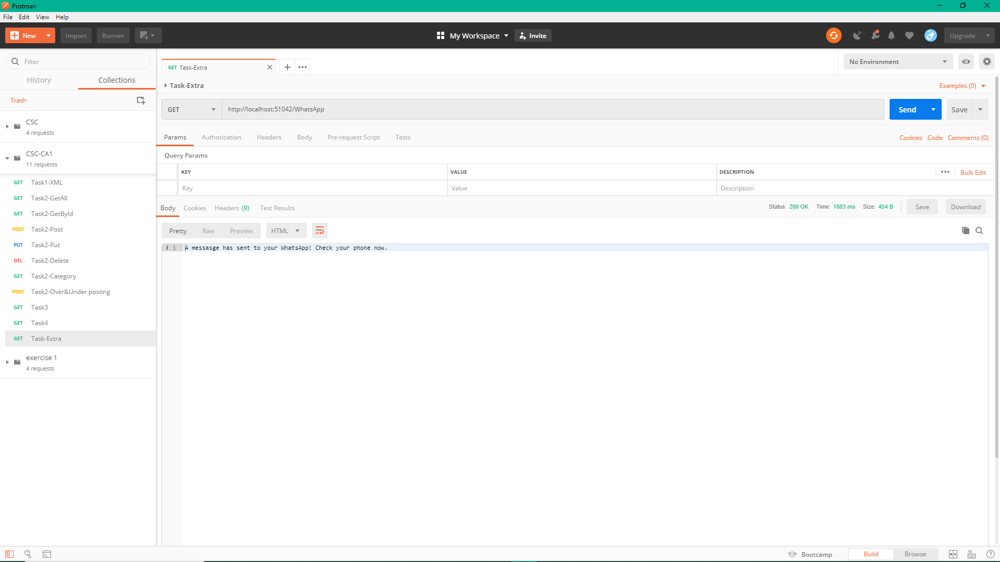
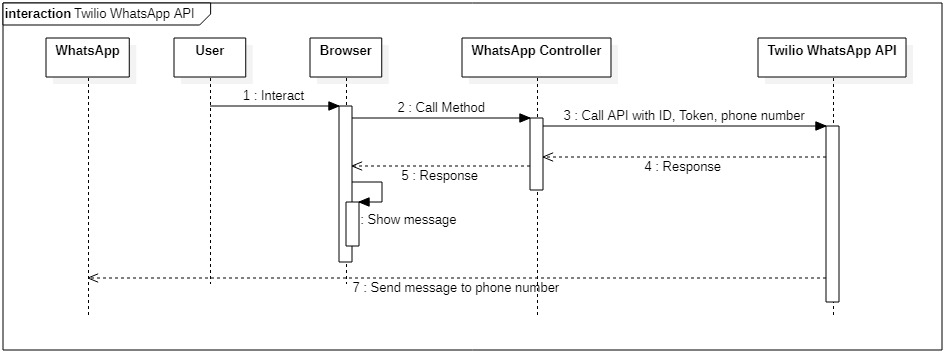

# task-extra
Pang Jing Hui | P1845259 

## Web API Document
| No. | HTTP Method  | Route | Description |
| ------------- | ------------- | ------------- | ------------- |
| 1. | GET | /WhatsApp | Call Twilio API, return a string content. |

## Postman testing
### Call Twilio API to send message to WhatsApp:

a string is returned when the Twilio API successfully sends out the message.

# Sequence Diagrams

# References:
1. https://www.twilio.com/docs/whatsapp/quickstart/csharp
2. https://www.twilio.com/docs/whatsapp/api#overview
3. https://www.youtube.com/watch?v=sL-lfKV78t4
4. https://www.youtube.com/watch?v=ndxQXnoDIj8
